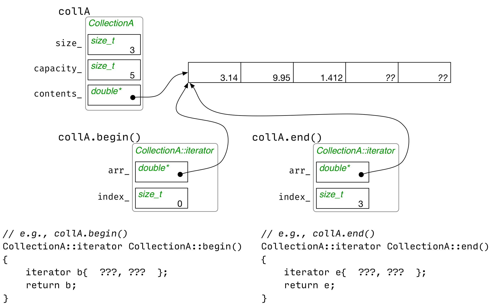

---
# Lecture 6a
[](6anotes)

---
## Learning Targets
1. I can read complicated C++ types
2. I can explain why iterators are useful in C++
3. I can describe what functionality a class must support to have iterators
4. I can write code that uses iterators to loop through the collections

## Review
1. You can read any declarations using the "inside out" rule. To do this, start"on the inside" at the variable name, go right, then left, and "spiral" outwards as needed. 

	_1. int x;_
    
	_2. Cow barn[10];_
    
	_3. Cow* v;_
    
	_4. const int * w1;_
    
	_5. int * const w2;_
    
	_6. int *z[5];_
    
	_7. int (*y)[4];_
    
	_8. const Cow (* const (*q)[4])[6]_

	Answers;

	_1. x is an int_
    
	_2. barn is an array of 10 cows_
    
	_3. v is a pointer to a cow_
    
	_4. w1 is a pointer to a constant int_
    
	_5. w2 is a const pointer to an int_
    
	_6. z is an array of 5 pointers of ints_
    
	_7. y is a pointer to a size 4 array of ints_
    
	_8. q is a pointer to an array of size 4 const pointers to an array of size 6 const Cows_


2. Which Member Functions should be const?
```C++
class StringStack {
public:
    void push(const std::string& pushee);
    bool empty();
    std::string& top(); // Access top element
    void pop(); // Discard top element
private: ...
};
```
3. Implementation 1. Dynamic Array
 
4. Implementation 2. Linked List

#### Option 1. Strengths and Weaknesses?
```C++
class StringStack {
public:
    void push(const std::string& pushee);
    ...etc...
    
    void print() const;
    bool hasString(const std::string& searches) const;
    bool hasDuplicates() const;
    ...etc...
};
```
Weaknesses:
* We need to run through all the values for print, finding a string, and having duplicates.
* The user is forced to go implement the StringStack functions, or have some
  external program to do the same thing. 
  
#### Option 2. Strengths and Weaknesses?
```C++
class StringStack {
public:
    void push(const std::string& pushee);
    ...etc...
    
    std::string& operator[](size_t index);
    const std::string& operator[](size_t index);
    ...etc...
};
```
Weaknesses:

#### Arrays and Pointer Arithmetic
The following are quivalent (if it's an array of strings)

```C++
for(size_t i = 0; i < DATA_LEN; ++i) {
    std::cout << data[i];
}

for (std::string* p = data; p != data + DATA_LEN; ++p) {
    std::cout << *p;
}
```
In this case the != on the second one emphasizes the "while you haven't gone
too far out of the data structure".

#### Using Iterators Effectively
Every collection type that we have in C++ all have iterators.
1. Set my iterator to the beginning of the data structure
2. As long as I haven't fallen off the data structure, keep going.

```C++
// Print the integers in the vector<int> v
for (vector<int>::iterator i = v.begin(); i != v.end(); ++1)
    cout << *i << endl;

// Print characters of string s
for (string::iterator i = s.begin(); i != s.end(); ++i)
    cout << *i << endl;

// Print strings of set<string> t
for (set<string>::iterator i = t.begin(); i != t.end(); ++i)
    cout << *i << endl;

// Print booleans in list<bool> l
for (list<bool>::iterator i = l.begin(); i != l.end(); ++i)
    cout << *i << endl;
```

What does an iterator need?
* .begins()
* .end()
* .operator++()
* .operator*() If I'm pointing there, how to I handle the necessary data
* .operator==()
* .operator!=()
* Constructor (Copy Assignment Constructor at least)
* Destructor (?)

Using iterators, how could we:
1. Print all the elements in a StringStack?
2. Check if a StringStack contains "swordfish"?
3. Check if a StringStack is empty (without calling .empty())? 
   
```C++
// Printing all the elements in a StringStack
StringStack ss = ...;
for (string::iterator i= ss.begin(); i != ss.end(); ++i)
    cout << *i;

// Check if StringStack contains "swordfish"
bool found = false;
for (string::iterator i= ss.begin(); i != ss.end(); ++1) {
    if (*i == "swordfish") {
        found = true;
    }
}

// Check if a StringStack is empty
ss.begin() == ss.end();
```
---
# Lecture 6b
[](6bnotes)

---

# Learning Targets
1. I can write a C++ class that supports the iterator idiom.
2. I can write C++ code that uses iterators
3. I am ready to start Homework 5

# Review
## Accessing Private Data
```C++
class C {
private:
    int data_;

};

class D {
    int peek(C other);
};

int D::peek(C other) {
    //Error
    return other.data_;
}
```
The method above won't work, so we need to use a thing called friendship. We need to add the friend class.

```C++
class C {
private:
    int data_;
};

class D {
    int peek(const C& other);
// This allows C to access D's data
friend class C;
};
```
The friend class only goes one way, so in the example above, we only get that C can access D's data, but D can't access C's data. 

## Nested Classes
```C++
class LinkedList {
    // ...Linked List stuff
    class Node {
    // ...Node Stuff
    };
    
    // Linked list stuff
};
```
With this, you can make the node public or private. 



## Thinking about iterators: key questions
* What data should we store in an iterator (to keep track of where we are)?
* What data is in the begin() iterator?
* What do the iterator operations do with this data?
    * in operator!=
    * in operator*
    * in operator++
* What data is in the end() iterator?
## Implementing iterators
### Collection A
Suppose the class CollectionA stores doubles in a vector-like fashion.

There are lots of possible iterator designs.

*Today: a pointer to the array plus an integer index.

Pointers are not the same thing as an iterator, but you can use pointers to implement iterators.

## Implementing begin and end
```C++
// e.g, collA.begin()
CollectionA::iterator CollectionA::begin() {
    iterator b{contents_, 0};
    return b;
}

CollectionA::iterator CollectionA::end() {
    iterator b{_contents, size_};
}
```

## Implementing operator* and operator++
```C++
double& CollectionA::iterator::operator*()
{
    return arr_[index];
}

CollectionA::iterator& CollectionA::iterator::operator++() {
    ++index_;   
    return *this;
}
```

## Polishing Our Iterators
### Type Abbreviations
We create a helpfully-named synonyms for existing types.
```C++
using cowptr_t = Cow*;

cowptr_t cp = new Cow;
```
## Useful STL (Standard Template Library) algorithms
```C++
#include <algorithm>
#include <numeric>
#include <vector>

void demo(const std::vector<int>& v) {
    int sum = std::accumulate(v.begin(), v.end(), 0);
    int has_42 = std::find(v.begin(), v.end(), 42) != v.end();
}
```
### Making an STL-compatible iterator
```C++
#include <iterator>
#include <cstddef>

class CollectionA {

    class iterator {
    public:
        using value_type        = double;
        using reference         = value_type&;
        using pointer           = value_type*;
        using difference_type   = ptrdiff_t;
        using iterator_category = std::forward_iterator_tag;
        ...as before...
    };
    
    ...as before...
};
```
## Which are OK?
```C++
std::string s{"Hello"};
std::string::iterator i;

// This is okay
std::cerr << s << std::endl;

// We didn't initialize this, s or any collection that we have
// to iterate on, so it is an invalid iterator. 
std::cerr << *i << std::endl;
```
## Which are OK?
```C++
void processAnyString(std::string s) {
    std::string::iterator i = s.begin();
    
    // debugging output
    std::cerr << s << std::endl;
    
    // If it's okay, then this line will output the first letter
    // However on an empty string, this produces an error
    std::cerr << *i << std::endl;
    
    // ...do the work
}
```
## Which are OK?
```C++
std::string::iterator i;
{
    std::string s{"hello"};
    i = s.begin();
    std::cerr << *i << std::endl; // This is okay
}

std::cerr << s << std::endl; // s is outta scope, compiler error
std::cerr << *i << std::endl; // s is destroyed so there's nothing for i to point to 
```

## Which are OK?
```C++
std::string s{"hello"};
std::string::iterator i = s.begin();

// Apparently if you touch a string (besides accessing the length)
// The string will be invalidated. 
s.pushback('!');

std::cout << s << std::endl;
std::cout << *i << std::endl;
```
This brings up the point with how are we supposed to know what will make an iterator invalid. To find this, we will need to look up the documentation for the iterator. 

```C++
std::list<int> s{1,2,3};
std::list<int>::iterator i = s.begin();

s.push_front(0);
s.push_back(4);

// This is okay, because the iterator will still "point" to 
// the initial beginning. 
std::cout << *i << std::endl;
```
## What data should an IntList::iterator object contain?
We will be implementing this using pointers. The iterator should be an Element pointer (for the homework, it may just be a node pointer).

If we have some Element p*. 
```C++
Element* p;
p->next_ // operator++
p->value // operator*
```
