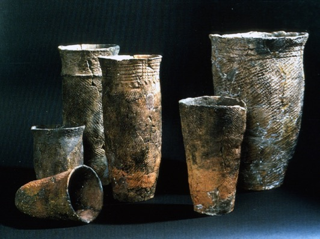

# The Arts of Japan

## Table of Contents
1. [Prehistoric Era](#prehistoric)
2. [Asuka and Nara](#asuka)
3. [Heian](#heian)
4. [Kamakura, Ashikaga, and Muromachi](#kamakura)
5. [Momoyama and Edo](#edo)
 
## Prehistoric 

---

Time period: 11th mil. bce- 6th c. ce

#### Pre-Jōmon and Jōmon Culture  
Mesolithic age (c. 15000-300BCE) that focused on hunting, fishing, and gathering. This name was adopted because of the cord like impressions that were found in the tall tubular ritual vessels that first emergered around 7500BCE.The earlier type of pottery comprises round bowls with smooth, sparingly decorated walls and wide mouths opening to generous interiors. They are uniform in proportion and are produced by punching and kneading clay. They were used for utility.  

|  |
| :--:                                                                                                     |
| *Early Jomon Period Pots 7000-5000 BCE with impressed rope patterns*                                     |

---

## Asuka and Nara 

Time period: 552-794ce

---

## Heian 

Time period: 794-1185ce

---

## Kamakura, Ashikaga, and Muromachi 

Time period: 1185-1573ce

---

## 16th Momoyama/Edo 

Time period: 1576-1868ce

